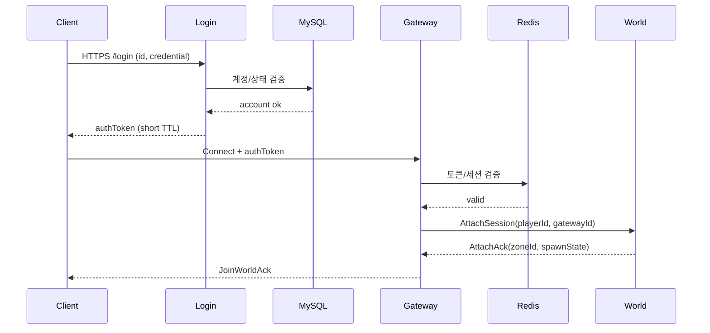
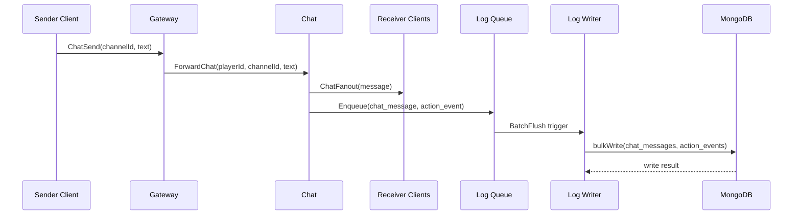
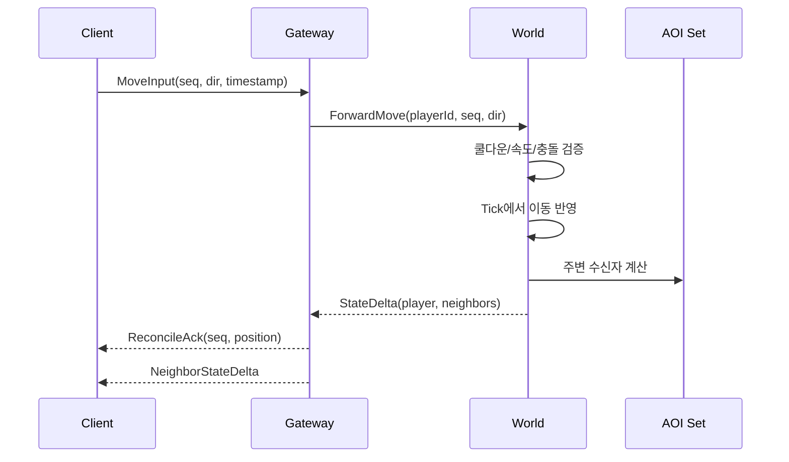
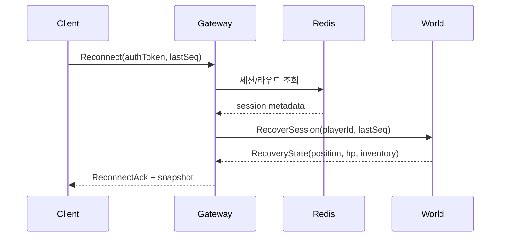

# 시퀀스 다이어그램

이 문서는 포트폴리오 프로젝트의 핵심 서비스 상호작용을 정리한다.

## 1) 로그인 및 세션 부착

## 2) 채팅 전송 및 로그 저장

## 3) 권한형 이동 검증

## 4) 재접속 및 상태 복구

## 5) 메모

- 재현성을 위해 timestamp와 sequence number를 반드시 로그로 남긴다.
- 핫패스 핸들러에서 tick 실행 중 직접 DB write를 피한다.
- 재접속 플로우는 idempotent 연산을 우선한다.
