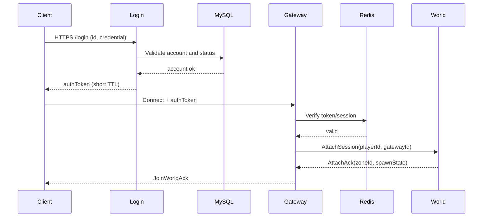
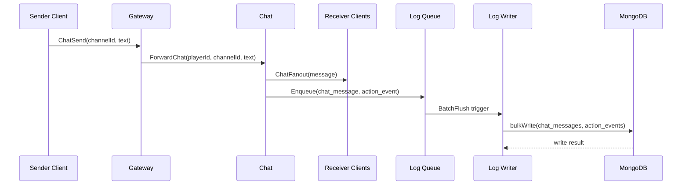
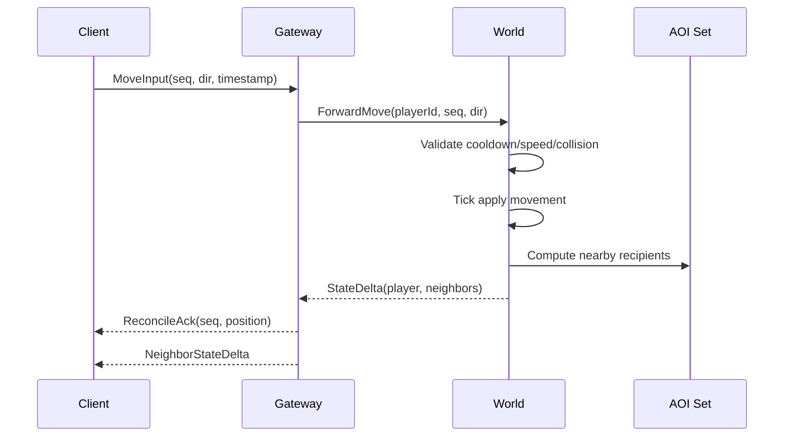
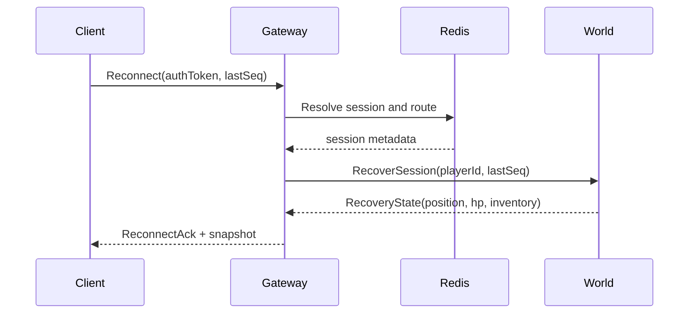

# Sequence Diagrams

This document captures core service interactions used in the portfolio project.

## 1) Login and Session Attach

## 2) Chat Message and Log Write

## 3) Authoritative Movement Validation

## 4) Reconnect and State Recovery

## 5) Notes

- All timestamps and sequence numbers should be logged for replayability.
- Hot-path handlers should avoid direct DB writes inside tick execution.
- Reconnect flow should prefer idempotent operations.
